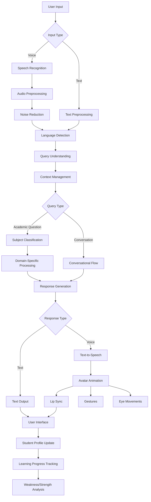

# AI_teacher
This AI application teach students, solve thier doughts, take tests, make studens scoller in subject


# AI Teaching Tutor

## Project Overview
This project is an AI-powered teaching assistant designed to process text and voice inputs, understand queries, and generate responses using NLP and ML techniques. It includes features such as speech recognition, text-to-speech conversion, avatar animations, and learning progress tracking.

## Flowchart
Below is the flowchart describing the AI tutor's workflow:



## Features
- **Text and Voice Input Processing**
- **Speech Recognition & Audio Preprocessing**
- **NLP-based Query Understanding**
- **Academic & Conversational Query Handling**
- **AI-Driven Response Generation**
- **Avatar Animation with Lip Sync, Gestures, and Eye Movements**
- **Learning Progress Tracking and Analysis**

## Installation
1. Clone the repository:
   ```sh
   git clone https://github.com/tripathishivam1444/AI_teacher.git
   ```
2. Navigate to the project folder:
   ```sh
   cd AI_teacher
   ```
3. Install dependencies:
   ```sh
   pip install -r requirements.txt
   ```
4. Run the application:
   ```sh
   python main.py
   ```

## Contributing
Feel free to contribute by submitting issues, feature requests, or pull requests. Let's build an AI-powered tutor together!

## License
This project is licensed under the MIT License. See the LICENSE file for details.
